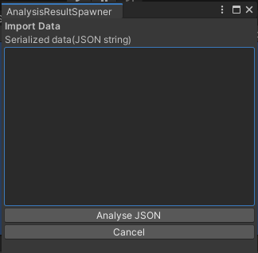
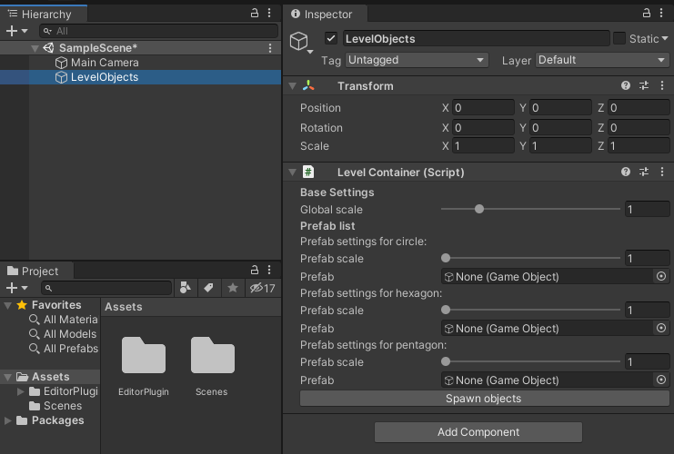
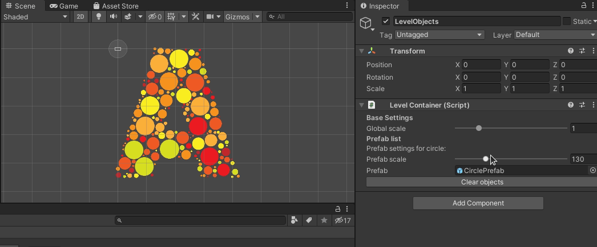

# SimpleShapeObjectPlacer

This simple tool is meant to releave you of repetative and booring work of placing a lot of 2D objects from a image in a single scene.

The tool comes in 2 parts:
- Python image analysis script that detects simple shapes and saves their `colors`, `positions`, `relative scale`, `rotation` to json file (located in `ImageAnalysis` folder)
- Unity editor plugin that can parse json contents and can spawn prefabs in scene with modifiable global scale and category scale

## Setup

First you will need to use ImageAnalysis script [(more info about setup and usage here)](ImageAnalysis/README.md) with image file containing shapes that you want to place in level like: 

once you have run the `ImageAnalysis.py -i <pathToFile>` and got the json file you can now move to Unity and copy contents of `EditorPlugin` folder to your Unity projects Assets folder.

## Usage in editor

In Unity editor you can now run `Tools/Spawn Objects from JSON` that should open a window like 

Paste the contents of your JSON file inside the textbox and press Analyse JSON.

After JSON has succesfully been loaded you will need to create prefabs for your simple shapes and place them inside `LevelObjects/LevelContainer` fields

and then finnaly you can press `Spawn Objects` and adjust scale of them 

# TODOS

- [ ]  For now color change works with prefabs that contain sprite
- [ ]  `ImageAnalysis.py` cant detect color of hollow objects
- [ ]  Code cleanup
- [ ]  Maybe add dynamic shape generation
- [ ]  Some objects are compiled in game but they are not needed there

# Contribution

You are free to contribute :)